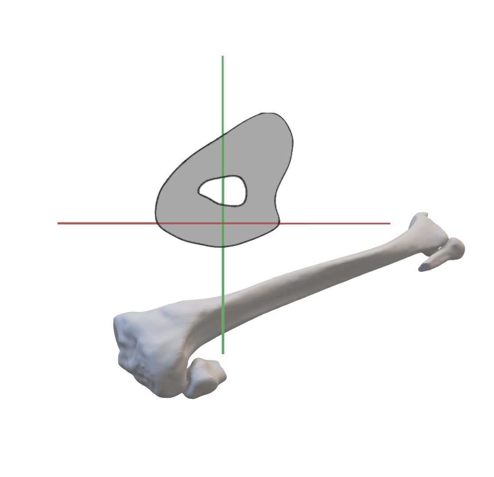

  

# BiomechScript

## 目次

- できること
- 使用方法
- メリット
- コンタクト

## できること

- オブジェクトの長さの取得(z 軸に対して)
- 3D オブジェクトの断面取得(z 軸に対して垂直に clipping)
- クリックした部分の座標を取得
- 断面積の計算
- 断面の断面二次モーメントの計算
- 断面の断面二次極モーメントの計算(現在作成中)

## 使用方法

0. git clone 等でファイルをローカルに保存
1. vs コードをインストール
2. vs コードの拡張機能として Live Server をインストール
3. 右下の『Go live』を押す

## メリット

- OS 依存がない (本プログラムはブラウザで使用できる。そのため Windows、Mac、など様々な OS で使用できる。)
- CT 座標系に依存しない (バイオメカニクス分野において骨の分析には座標変換をする必要がある。そのため CT 座標系ではなくローカル座標系を組んだ後のモデルに対して計測が可能。)
- キャッシュが残らない (特に骨モデルの分析に、グローバルサーバを使用するのは要注意。骨の情報、つまり個人情報がサーバのキャッシュに残ってしまう。その点、本プログラムはローカルサーバを立てるためローカルサーバを落とせばキャッシュは残らない。)

## コンタクト

- e-mail：chihokoku8060@gmail.com
